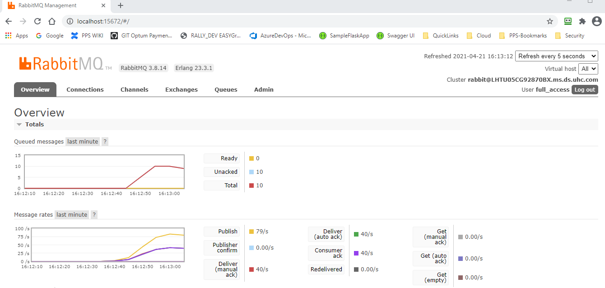

# Proof of Concept RabbitMQ as Message Broker

Simple solution with three programs
1. RPCClient - Client program, simulating the web app side generating request to back end servers to process
   
2. RPCServer - Server program, test app side reading request queue, performing calculations returning results
   
3. RabbitMQ - Message Broker

The RPCClient program reads in a bunch of words as defined in a file call TestData.txt.
The RPCClient program sends a word to server program for processing.

The RPCServer program reads words from request queue, adds dashes between the letters and sleeps 10Ms for each letter. This is to simulate some real time calculation (like easygroup)

The RPCServer program sends reply back to the reply-to queue as specified in the incoming message

The RPCClient program display the result.

<br />
## From rabbitMQ Tutorials


<br/>
https://www.rabbitmq.com/getstarted.html

<br />
## DrawIO diagram


<br />
## RabbitMQ Management console




## RabbitMQ on Docker Starter: Multi-Containers

```Docker
docker-compose build
docker-compose up --scale RPCServer=3

# Start RabbitMQ only
docker-compose run --service-ports rabbitmq

```
```bash
# RabbitMQ management website logins TEST ONLY
admin:admin123 (admin account)
ops0:ops0 (msg producer account)
ops1:ops1 (msg consumer account)
```

### docker-compose.yml
```bash
services:
  rabbitmq:
    image: rabbitmq:3-management-alpine
    hostname: my-rabbit
    container_name: rabbitmq
    volumes:
      - ./rabbitmq/etc/definitions.json:/etc/rabbitmq/definitions.json
      - ./rabbitmq/etc/rabbitmq.conf:/etc/rabbitmq/rabbitmq.conf
      - ./rabbitmq/data:/var/lib/rabbitmq/mnesia/rabbit@my-rabbit
      - ./rabbitmq/logs:/var/log/rabbitmq/log
    ports:
      - 5672:5672
      - 15674:15672

  RPCClient:
    build: ./RPCClient
    image: rpc.client-image
    container_name: rpc.client
    ports:
      - 5000:80
    environment:
      - ASPNETCORE_ENVIRONMENT=Development
      - ASPNETCORE_URLS=http://+:80
      - RABBIT_HOSTNAME=rabbitmq
      - sleepTime=18000
    restart: on-failure
    depends_on:
      - rabbitmq

  RPCServer:
    build: ./RPCServer
    image: rpc.server-image
    environment:
      - ASPNETCORE_ENVIRONMENT=Development
      - RABBIT_HOSTNAME=rabbitmq
      - sleepTime=18000
    restart: on-failure
    depends_on:
      - rabbitmq
```

## DEMO 1. Run RPCClient and RPCServer on laptop

   


## DEMO 2. Run Solution in docker

   

